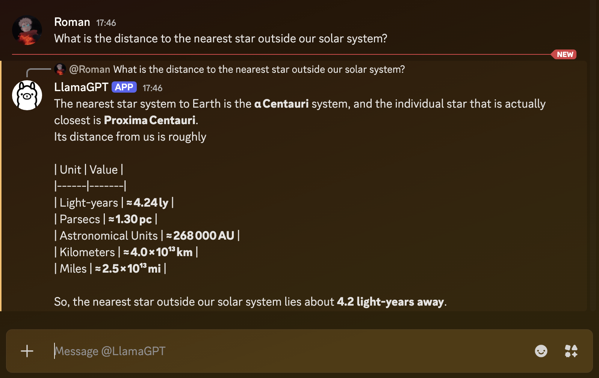

# discord‑llm‑bot

A lightweight Discord bot that forwards user mentions to a **locally hosted LLM via Ollama**.  
The bot also logs every exchange to an SQLite database and prints the model’s internal “thinking” text for debugging.



> **Why Ollama?**  
> Ollama gives you instant, zero‑cost inference on your own machine, with a convenient HTTP API and a catalog of open‑source models.

---

## Table of Contents

- [Prerequisites](#prerequisites)
- [Installation](#installation)
  - [Python & Virtual Environment](#python--virtual-environment)
  - [Python Dependencies](#python-dependencies)
- [Ollama Setup](#ollama-setup)
  - [Installing Ollama](#installing-ollama)
  - [Pulling a Model](#pulling-a-model)
  - [Running the Ollama Service](#running-the-ollama-service)
- [Discord Bot Configuration](#discord-bot-configuration)
  - [Creating a Discord Bot](#creating-a-discord-bot)
  - [Setting Environment Variables](#setting-environment-variables)
- [Running the Bot](#running-the-bot)
- [Testing](#testing)
- [License](#license)

---

## Prerequisites

| Component | Minimum Version |
|-----------|-----------------|
| Python    | 3.11+           |
| Ollama    | 0.1.26+ (latest)|
| Discord API token | *created via Discord Developer Portal* |

> **Tip:** If you don’t already have a virtual‑env tool, install `venv` via `python -m pip install virtualenv`.

---

## Installation

### Python & Virtual Environment

```bash
# Create a dedicated virtual environment
python -m venv .venv
# Activate it (Linux/macOS)
source .venv/bin/activate
# Activate it (Windows)
.venv\Scripts\activate
```

### Python Dependencies

The bot relies on the following Python packages:

- `discord.py` – The official Discord library
- `aiohttp`   – Async HTTP client used by the bot to talk to Ollama
- `pytest`    – For the test suite
- `pytest-asyncio` – Async test support
- `pytest-mock` – Easier mocking in tests

Install them with:

```bash
pip install -U pip
pip install -U discord.py aiohttp pytest pytest-asyncio pytest-mock
```

---

## Ollama Setup

### Installing Ollama

Ollama is a lightweight wrapper that lets you run many LLMs locally.  
Download and install the latest release: <https://ollama.com/>

### Pulling a Model

Once installed, you can pull any model from the public catalog.  
For example, to pull a 20 B “gpt‑oss” model:

```bash
ollama pull gpt-oss:20B
```

You can list available models:

```bash
ollama list
```

> **Tip:** Models can be large (hundreds of MB). Make sure you have enough disk space.

### Running the Ollama Service

After pulling, start the service:

```bash
ollama serve
```

It will bind to `http://localhost:11434` by default.  
If you prefer a custom port or address, use:

```bash
ollama serve --host 0.0.0.0 --port 11434
```

You can test the API manually:

```bash
curl -X POST http://localhost:11434/api/chat \
  -H "Content-Type: application/json" \
  -d '{"model":"gpt-oss:20B","messages":[{"role":"user","content":"Hello"}]}'
```

You should see a JSON response with `message.content`.

For Apple Silicon here are some settings I have found useful:

```bash
# Ensure Metal is the priority
export OLLAMA_METAL_ENABLED=1

# Use quantized KV cache to save VRAM (lets you use longer context)
export OLLAMA_KV_CACHE_TYPE="q8_0"

# Set a reasonable default context window (standard is 4096)
# Higher context takes more VRAM, so keep it at 8192 for the best balance
export OLLAMA_NUM_CTX=8192
```

---

## Discord Bot Configuration

### Creating a Discord Bot

1. Go to the [Discord Developer Portal](https://discord.com/developers/applications).  
2. Create a **New Application**.  
3. In the **Bot** tab, click **Add Bot** → **Yes, do it!**  
4. Under **Token**, click **Copy**. This is your `DISCORD_TOKEN`.  
5. Under **Privileged Gateway Intents**, enable **MESSAGE CONTENT INTENT**.  
6. In **OAuth2 → URL Generator**, select the **bot** scope and the following permissions:
   - Send Messages
   - Read Message History
   - Mention Everyone (optional, for debugging)
   - (Add any others your use‑case needs)

   Copy the generated URL and open it in a browser to invite the bot to a server you manage.

### Setting Environment Variables

Set the token in the shell to avoid leaks (replace YOUR_DISCORD_BOT_TOKEN with your token):

```bash
export DISCORD_TOKEN=YOUR_DISCORD_BOT_TOKEN
```

---

## Running the Bot

```bash
# Activate the venv first (if not already active)
source .venv/bin/activate

# Start the bot
python LlamaGPT.py
```

You should see output like:

```
[DM] alice (123456): Hello
[Assistant] Hi there
```

The bot will now reply to any `@<bot>` mention in any channel it has access to, and will also handle direct messages.

---

## Testing

The repository includes a comprehensive `pytest` suite.

```bash
# Activate venv
source .venv/bin/activate

# Run tests
pytest
```

All external dependencies (Discord, HTTP, atexit) are mocked, so tests run quickly and reliably.

---

## License

MIT © Cameron Giarrusso
